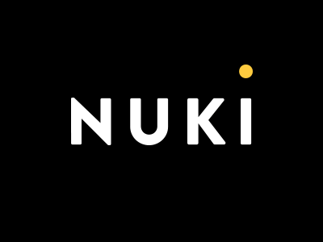

# ioBroker.nuki2
This ioBroker adapter allows to control and monitor the [Nuki Smart Lock](https://nuki.io/de/) by using the [API of the Nuki Bridge](https://developer.nuki.io/page/nuki-bridge-http-api-170/4/#heading--introduction).

[](https://www.npmjs.com/package/iobroker.nuki2)
[](https://travis-ci.org/Zefau/ioBroker.nuki2)
[](https://www.npmjs.com/package/iobroker.nuki2)

[](https://nodei.co/npm/iobroker.nuki2/)

**Table of contents**
1. [Installation](#installation)
   1. [Get a API token](#get-a-api-token)
   2. [Callback function](#callback-function)
   3. [States](#states)
2. [Smart Home / Alexa integration using ioBroker.javascript](#smart-home--alexa-integration-using-iobrokerjavascript)
3. [Changelog](#changelog)
4. [Credits](#credits)
5. [Licence](#license)


## Installation
### Get a API token
How to get your bridges token:

1. Call ```http://<bridge_ip>:<bridge_port>/auth``` from any browser in your network
2. The bridge turns on its LED
2. Press the button of the bridge within 30 seconds
3. Result of the browser call should be something like this: ```
    {
    "token": “token123”,
    "success": true
    }```

### Callback function
If the callback function is being used, the adapter will try to automatically set the callback on the Nuki bridge when the instance is being saved. All Nuki states will be kept up-to-date by the Nuki bridge while callback is activated.
Callbacks can also be set and removed manually from any browser with following URLs:

* set Callback: ```http://<bridge_ip>:<bridge_port>/callback/add?url=http%3A%2F%2F<host_ip>%3A<host_port>%2Fapi%2Fnuki&token=<bridgeToken>```
* remove Callback: ```http://<bridge_ip>:<bridge_port>/callback/remove?id=<callback_id>&token=<bridgeToken>```
* list all Callbacks: ```http://<bridge_ip>:<bridge_port>/callback/list?token=<bridgeToken>```

### States
If you successfully setup ioBroker.nuki2, the following channels and states are created:

#### Bridges
A bridge will be created as device with the name pattern ```bridge__<name of bridge>```. The following channels / states will be created in each bridge:

| Channel | State | Description |
|:------- |:----- |:----------- |
| - | \_connected | Flag indicating whether or not the bridge is connected to the Nuki server |
| - | bridgeId | ID of the bridge / server |
| - | bridgeIp | IP address of the bridge |
| - | bridgePort | Port of the bridge |
| - | bridgeType | Type of bridge |
| - | hardwareId | ID of the hardware bridge (hardware bridge only) |
| - | refreshed | Timestamp of last update |
| - | uptime | Uptime of the bridge in seconds |
| - | versFirmware | Version of the bridges firmware (hardware bridge only) |
| - | versWifi | Version of the WiFi modules firmware (hardware bridge only) |
| - | versApp | Version of the bridge app (software bridge only) |

#### Locks
A lock will be created as device with the name pattern ```door__<name of door>```. The following channels / states will be created in each bridge:

| Channel | State | Description |
|:------- |:----- |:----------- |
| - | action | Trigger an action on Home Door |
| - | bridge | Bridge of the Nuki |
| - | id | ID of the Nuki |
| - | name | Name of the Nuki |
| status | batteryCritical | States critical battery level |
| status | locked | Indication if door is locked |
| status | refreshed | Timestamp of last update |
| status | state | Current lock-state of the Nuki |


## Smart Home / Alexa integration using ioBroker.javascript
Some examples of a possible integration within your smart home.

### Lock door at 10pm in the evening
```javascript
var states = {
    "0": "uncalibrated",
    "1": "locked",
    "2": "unlocking",
    "3": "unlocked",
    "4": "locking",
    "5": "unlatched",
    "6": "unlocked (lock n go)",
    "7": "unlatching",
    "254": "motor blocked",
    "255": "undefined"
};

schedule('0 22 * * *', function()
{
    var status = (getState('nuki2.0.door__home_door.status.lockState').val);
    var msg = 'Main Door door is ' + (states[status]) + '. ';

    if (status == '3')
    {
        setState('nuki2.0.door__home_door.action', 2);
        msg += 'Locking door..'
    }
    else
        msg += 'No action taken.'

    log(msg, {m: 'Nuki', o: ['msg']});
});
```

__Replace `nuki2.0.door__home_door.status.lockState` with the lockState of your lock!__ You may also customize the message via `msg`.


## Changelog

### 0.9.0
* (zefau) Using both Bridge API and Web API
* (zefau) Support for multiple bridges
* (zefau) Support for discovery within admin panel
* (zefau) Additional states for bridges and better separation between software / hardware bridge


## Credits
Thanks to [@Mik13](https://github.com/Mik13) for the [Nuki Bridge API implementation](https://github.com/Mik13/nuki-bridge-api#nuki-bridge-api) and [@intelligencecompany](https://github.com/intelligencecompany) for the [Nuki Web API implementation](https://github.com/intelligencecompany/nuki-api).


## License
The MIT License (MIT)

Copyright (c) 2019 Zefau <zefau@mailbox.org>

Permission is hereby granted, free of charge, to any person obtaining a copy
of this software and associated documentation files (the "Software"), to deal
in the Software without restriction, including without limitation the rights
to use, copy, modify, merge, publish, distribute, sublicense, and/or sell
copies of the Software, and to permit persons to whom the Software is
furnished to do so, subject to the following conditions:

The above copyright notice and this permission notice shall be included in
all copies or substantial portions of the Software.

THE SOFTWARE IS PROVIDED "AS IS", WITHOUT WARRANTY OF ANY KIND, EXPRESS OR
IMPLIED, INCLUDING BUT NOT LIMITED TO THE WARRANTIES OF MERCHANTABILITY,
FITNESS FOR A PARTICULAR PURPOSE AND NONINFRINGEMENT. IN NO EVENT SHALL THE
AUTHORS OR COPYRIGHT HOLDERS BE LIABLE FOR ANY CLAIM, DAMAGES OR OTHER
LIABILITY, WHETHER IN AN ACTION OF CONTRACT, TORT OR OTHERWISE, ARISING FROM,
OUT OF OR IN CONNECTION WITH THE SOFTWARE OR THE USE OR OTHER DEALINGS IN
THE SOFTWARE.
